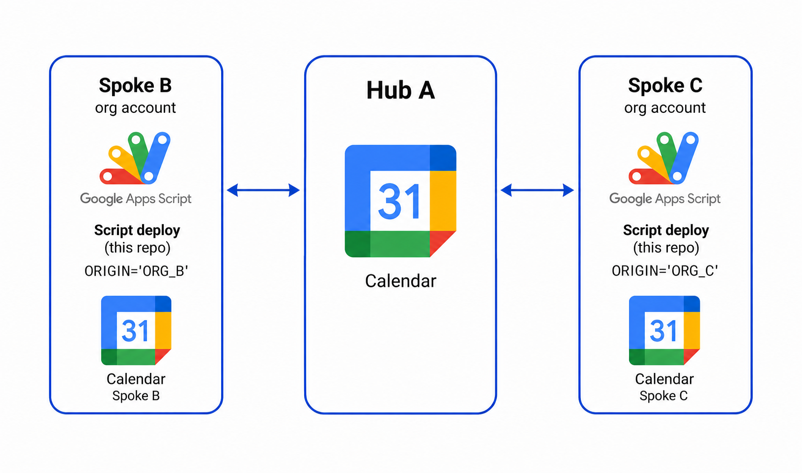

# Cross-Account Calendar Sync (Hub & Spoke)

A Google Apps Script project that bidirectionally syncs events between a central "hub" calendar and multiple "spoke" calendars (e.g., work accounts). One deployment of this script is installed per spoke account.

## Background

Google Calendar has no native support for bidirectional sync between calendars owned by different accounts. Third-party tools exist but often lack control over privacy, recurrence handling, and loop prevention. This project provides a self-hosted alternative using the Google Calendar Advanced Service (v3 API) within Apps Script.

## Motivation

When you work across multiple organizations or maintain both a hub calendar and work calendars, keeping availability in sync is critical to avoid double-bookings. The key challenges this project solves:

1. **Infinite loop prevention** - Bidirectional sync between the same pair of calendars can easily create runaway duplication. Naive approaches where a copy triggers another copy are a well-known failure mode.
2. **Recurring events without an end date** - Most sync tools expand recurring events into individual instances (`singleEvents: true`), which breaks for infinite recurrences and creates excessive API load.
3. **Previously synced event tracking** - Without persistent identity mapping, the system would create duplicates on every run instead of updating existing copies.

## Solution

### Architecture

Each spoke runs its own copy of the script with a unique `THIS_ACCOUNT_ORIGIN_NAME`. The hub calendar receives events from all spokes and distributes events back (stripped of details for privacy).

### Key Design Decisions

**Loop prevention via origin tagging.** Every synced event is stamped with `extendedProperties.private.ORIGINAL_CALENDAR_ID` identifying which spoke it originated from. When the script reads events from the hub, it skips any that carry its own origin tag. When reading from the spoke, it skips any that carry a foreign origin tag (meaning they were already synced in from the hub).

**Native recurrence handling.** The API is queried with `singleEvents: false`, which returns master recurring event objects with their `recurrence` RRULE intact. This correctly handles infinite recurrences without exploding them into thousands of instances.

**Incremental sync with tokens.** After the initial run (which uses `updatedMin` as a 14-day lookback), subsequent runs use the Google Calendar `syncToken` for efficient delta processing. Expired tokens are detected and trigger a full re-sync on the next cycle.

**Exception event retry.** Since the Calendar API doesn't guarantee master events appear before their exceptions in a response page, exception events that can't find their master on the target are deferred and retried after all events in the current cycle are processed.

**Upsert semantics.** Each event is looked up on the target by its `ORIGINAL_EVENT_ID` extended property. If found, it's patched (updated). If not found, it's inserted. If the source event is cancelled, the target copy is deleted.

## Files

| File | Purpose |
|------|---------|
| `Code.gs` | Configuration, entry point (`syncAllDirections`), and trigger registration |
| `SyncEngine.gs` | Pagination, sync token management, and API list calls |
| `EventProcessor.gs` | Per-event logic: loop guards, payload construction, recurrence mapping, upsert |

## Setup

1. Create a new Google Apps Script project in the **spoke** account (the org/work account).
2. Enable the **Google Calendar API** under Services (Advanced Services).
3. Copy the three `.gs` files into the project.
4. Edit `CONFIG` in `Code.gs`:
   - Set `CALENDAR_A_ID` to the hub calendar's email address.
   - Set `THIS_ACCOUNT_ORIGIN_NAME` to a unique identifier for this spoke (e.g., `'ORG_B'`).
5. Run `registerTimeDrivenTrigger()` once to create the 15-minute polling trigger.
6. On first run, grant calendar read/write permissions when prompted.

Repeat for each additional spoke account, changing `THIS_ACCOUNT_ORIGIN_NAME` to a distinct value.

## Privacy

When syncing from the hub back to a spoke (`stripDetails: true`), event titles are replaced with "Busy" and descriptions/locations are cleared. Events synced from a spoke to the hub retain full details.

## Limitations

- Sync is polling-based (every 15 minutes), not push/real-time.
- The `extendedProperties.private` map is replaced on patch, which may overwrite private properties set by other systems on the same event.
- Apps Script execution time limit is 6 minutes per run. Very large calendars may need a shorter lookback window or per-direction execution.
